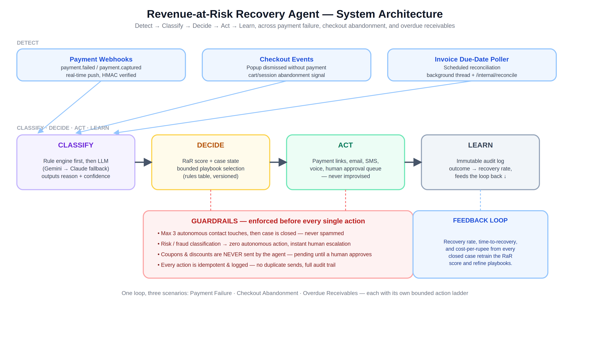

# AI Revenue Recovery Agent

**Razorpay Buildathon — AI Revenue Recovery track**

An agent that detects revenue slipping away across three different failure modes, diagnoses why, and runs a bounded, auditable recovery workflow to win it back — built on Razorpay's payments, payment links, and invoicing APIs.

## The problem

Online merchants lose revenue three structurally different ways:

| Scenario | What happens | Detection |
|---|---|---|
| **Payment Failure** | Customer tries to pay, it breaks (bank decline, timeout, risk block) | Real-time Razorpay webhook |
| **Checkout Abandonment** | Customer leaves without ever attempting payment | Popup dismissed, no failure event |
| **Overdue Receivables** | An invoice goes unpaid past its due date | Scheduled reconciliation poll |

A single "retry everything" bot is wrong for all three — retrying a risk-blocked card is dangerous, spamming an abandoned cart is harassment, and auto-discounting an overdue invoice without approval is a governance problem. This agent classifies which scenario it's looking at and picks a bounded action from a fixed playbook for that scenario specifically.

## Architecture



Five-stage loop, shared across all three scenarios: **Detect → Classify → Decide → Act → Learn.**

- **Detect** — push-first (HMAC-verified webhooks) with poll-based reconciliation for signals with no dedicated event (abandonment, overdue invoices).
- **Classify** — deterministic rule engine first; falls through to an LLM (Gemini 3.6 Flash primary, automatic fallback to Claude Haiku on quota errors) only for genuinely ambiguous cases. Every classification carries a confidence score.
- **Decide** — a versioned, inspectable rules table maps (scenario, risk score, classification) to exactly one playbook. Never improvised.
- **Act** — executes through real Razorpay APIs (payment links, invoices) plus Resend (email) and Twilio (SMS/voice), gated by hard guardrails.
- **Learn** — every outcome feeds back into risk scoring and policy tuning; every action is logged for audit.

See `docs/recovery_ladders_diagram.png` for the exact bounded step sequence per scenario, and `docs/state_machine_diagram.png` for the case lifecycle every case follows regardless of scenario.

## Guardrails (non-negotiable, enforced structurally)

- **No AI-sent discounts, ever.** Any coupon/discount action is written as `pending_approval` and only a human merchant clicking Approve can send it — enforced at the write path, not by convention.
- **Circuit breaker:** max 3 autonomous contact touches per case, then it stops.
- **Risk/fraud classification → zero autonomous action**, immediate human escalation.
- **Idempotent everywhere** — every action has a unique key; concurrent triggers can't double-send.
- **Full audit trail** — every decision, classification, and action is logged with its reasoning.

## Features by scenario

**Payment Failure** — source-aware classification (trusts Razorpay's real `error.source` over guessed rules), bounded retry/nudge ladder, instant escalation on risk blocks, dedicated dashboard with recovery-rate and circuit-breaker KPIs.

**Checkout Abandonment** — rule + LLM classification, VIP/high-value auto-escalation, multi-channel nudges (email/SMS/voice), coupon offers gated behind human approval.

**Overdue Receivables** — manual invoice issuance against real customers, real Razorpay payment links, a day-0/+7/+30/+60 dunning ladder, three independent payment-confirmation paths (webhook, redirect callback, poller fallback) so a payment is never missed even if one path fails.

**Unified Human Follow-ups** — every escalation and every pending coupon approval across all three scenarios in one filterable queue.

**Revenue Intelligence** — cross-scenario rollup: total at risk, recovered, lost, cost of discounts, DSO, and a combined audit trail.

## Tech stack

- **Backend:** Python, FastAPI, SQLAlchemy, SQLite
- **Frontend:** Jinja2 server-rendered templates
- **Payments:** Razorpay (Orders, Payment Links, Invoices, webhooks)
- **Notifications:** Resend (email), Twilio (SMS + voice)
- **Classification:** Gemini 3.6 Flash (primary), Claude Haiku 4.5 (fallback)

## Setup

```bash
git clone <this-repo-url>
cd <repo-folder>
python -m venv venv
source venv/bin/activate  # Windows: venv\Scripts\activate
pip install -r requirements.txt
cp .env.example .env
# Fill in your own API keys in .env
uvicorn app.main:app --reload --port 8001
```

Visit `http://localhost:8001` for the storefront, `http://localhost:8001/merchant` for the dashboard.

## Running tests

```bash
pytest                              # full pytest suite
python scripts/test_<name>.py       # individual integration scripts
```

Tests run against an isolated in-memory database and never touch `data/storefront.db`.

## Demo

5-minute pitch video: `<add your video link here>`

## Build journey & challenges

See [`PROCESS.md`](PROCESS.md) for a detailed log of what broke during development and how it was diagnosed and fixed.